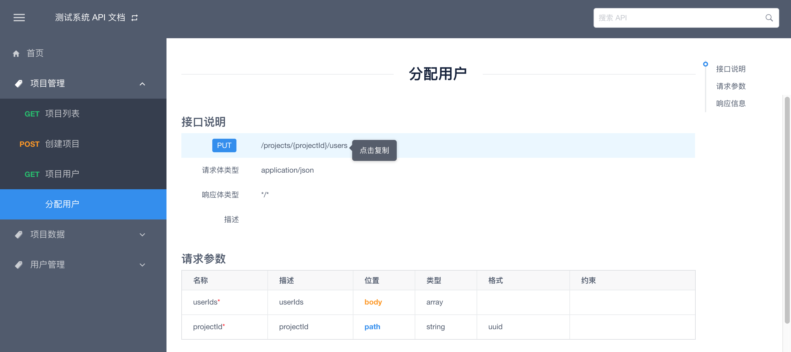
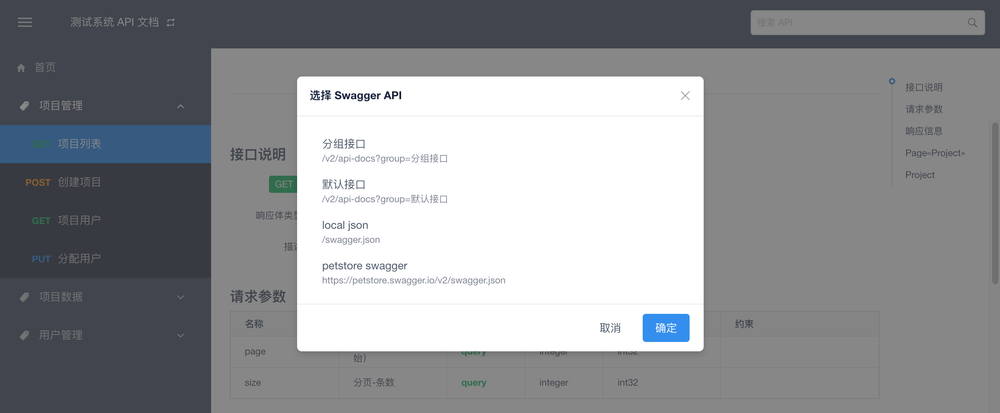
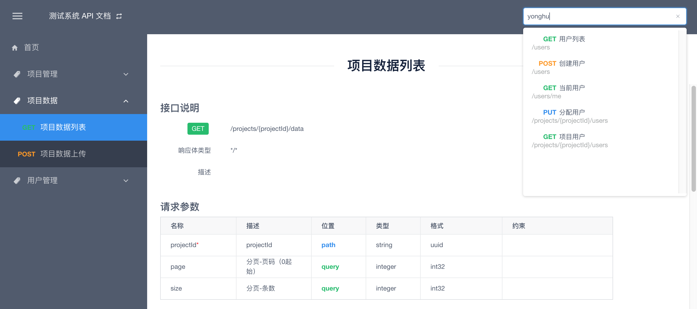

[](https://opensource.org/licenses/Apache-2.0)
[](https://travis-ci.org/cn-src/swagger-document-ui)

[](https://gitee.com/cn-src/swagger-document-ui/stargazers)

Swagger 文档型 UI

------
Swagger 规范接口的文档型 API UI 界面

主要使用 Vue CLI 3，iView 开发，主要体现文档的可读性功能，给接口调用者提供接口文档，省去文档编写。

[在线样例](http://cn-src.gitee.io/swagger-document-ui/swagger-ui.html)

[Github](https://github.com/cn-src/swagger-document-ui)

[码云](https://gitee.com/cn-src/swagger-document-ui)

[更新列表](https://github.com/cn-src/swagger-document-ui/releases)

# 使用方式
## 主要步骤
* 此项目需要配合 springfox 框架使用，因此使用之前需要对 springfox 有所了解
* 配置 swagger-document-ui 替换其它 UI
* 地址样例 http://localhost:8080/swagger-ui.html
* [springfox 官方文档](http://springfox.github.io/springfox/docs/current/)
* 此项目没有类似官方的在线测试/调试功能，建议使用 postman，支持 swagger 规范的接口导入，功能更强大

1. **移除**官方 UI 依赖
```xml
<dependency>
    <groupId>io.springfox</groupId>
    <artifactId>springfox-swagger-ui</artifactId>
    <version>${springfox.version}</version>
</dependency>
```

2. 添加 swagger-document-ui 依赖
```xml
<dependency>
    <groupId>cn.javaer.springfox</groupId>
    <artifactId>swagger-document-ui</artifactId>
    <version>0.2.1</version>
</dependency>
```

## Spring Boot 集成
与 Spring Boot 集成使用是最简单的方式，推荐使用 [程序猿DD/spring-boot-starter-swagger](https://gitee.com/didispace/spring-boot-starter-swagger)
提供的集成方式，然后你需要：

1. 排除自带 UI 依赖
```xml
<dependency>
    <groupId>com.spring4all</groupId>
    <artifactId>swagger-spring-boot-starter</artifactId>
    <version>${swagger-spring-boot-starter.version}</version>
    <!--排除自带 UI 依赖-->
    <exclusions>
        <exclusion>
            <artifactId>springfox-swagger-ui</artifactId>
            <groupId>io.springfox</groupId>
        </exclusion>
    </exclusions>
</dependency>
```

2. 添加 swagger-document-ui 依赖
```xml
<dependency>
    <groupId>cn.javaer.springfox</groupId>
    <artifactId>swagger-document-ui</artifactId>
    <version>0.2.1</version>
</dependency>
```

## 其它使用方式
此项目最终是生成纯静态资源，理论上来说只要你将 dist 目录里的静态文件部署到 web 服务器的根目录下即可使用，但前提是：你的项目中使用了 swagger 规范的 API 信息接口。

1. 其会请求 `/swagger-resources` （springfox 框架默认地址） 和 `/swagger-resources.json` （本项目新增地址） 拿到 API 信息接口地址。（项目 tests 目录里有样例）
2. 请求 `swagger-resources` 中配置的 `url`（优先） 或者 `location`（兼容旧版不提供 url 字段） 其应当返回 swagger 规范的 API 信息即可使用。
# 效果预览

## 右侧文档锚点导航


## 分组选择 API


## 模糊搜索
* 支持中文，拼音，英文
* 可搜索 API 名称，分类名称，url 路径



